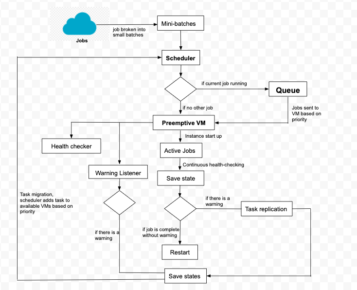

&nbsp;&nbsp;&nbsp;&nbsp;&nbsp;&nbsp; SPOT INSTANCE MANAGER IN GOOGLE CLOUD
============================================================================

Proposal
------------------
Like most cloud providers, Google Cloud provides spot instances for businesses and individual use. Depending on the type of instance, these spot instances come at different prices and with different efficiency. Google Cloud provides what are called "Preemptible VMs". These have fixed prices and the customer acknowledges that they will be terminated after 24 hours with a 30 seconds notice. Using these, they aim to make the market for ephemeral instances less complex and less fragmented. Basing on the fact that they provide a 30-second notice before eviction, in this project I aim to create an architecture that manages our google cloud instances. 

In this project, I aim implement a manager with a series of fault tolerance mechanisms to limit work loss during revocation of instances by Google Cloud. Among others, I aim to implement a mechanism that frequently checks for health and available instances where we can move our work to in cases of eviction. This means that, as soon as we receive the eviction notice, we should be able to migrate our work to a healthy instance almost instantaneously. In addition to that, to prevent work loss, I aim to implement a check-pointing mechanism. Since Google Cloud is guaranteed to terminate our instance after 24 hours, my manager tries to makes sure that regardless of whether we are evicted or not the work gets saved and moved to another instance. I will look through publications on cloud computing to find other mechanisms that could be added to my manager.

In my implementation, I will provide the design of my proposed architecture. I will also write source code and run experiments to gauge the performance of the manager.

Abstract
---------
Cloud service providers offer their unused resources for leasing in the spot market$^1$. One such service is provided by Google Cloud's Preemptible Virtual Machines. Preemptible VMs are Virtual Machines that offer lower costs in exchange for reduced reliability. Due to their below standard demand cost, they  can be used to compute resource intensive applications. The instances can however, be revoked at anytime depending on the fluctuations in their demand. To mitigate the impact of revocation, there is need to implement fault tolerance-mechanism. In this paper, we propose a manager for Google Cloud spot instances that aims to reduce the impact of spot instance revocation. The manager implements state of the art mechanisms like continuous batch check-pointing, Virtual Machine replication and Virtual Machine health checking. To take an advantage of Preemptible VMs 24-hour window, the manager implements a scheduler that prioritizes migration of work from VMs with expiring leases.

Introduction
------------
### Motivation ###
Cloud computing has evolved continuously over the years. Cloud service providers now offer a wide variety of compute resources to their customers that are both cost effective and efficient. However, in some cases, there is a trade off between cost effectiveness and efficiency of the service. One such service that offers low cost compute resources at the expense of reliability is spot instances like Google Cloud's Preemptive VMs. Preemptive VMs are instances that you can create and run at a lower cost than the normal on-demand instances$^2$. These instances require that your application has a fault tolerant mechanism because they can be terminated at anytime depending on their demand. These instances are good for batch processing jobs because if the machine is terminated when processing one batch, the whole job does not completely stop.\\
\\
Unlike Amazon's Elastic Computer Cloud(EC2), Google's Preemptible instances always terminate after they run for 24 hours and their work can not live-migrate to other VM instances. However, the machines can be restarted to renew the 24 hours lease, though they can not be restarted automatically. Even after migration, the discs need to be deleted to avoid incurring storage charges.\\
\\Looking at the features of the instances, there is need for models and mechanisms to minimize the amount of work lost when the instances terminate while at the same time taking advantage of the low costs. Effective mechanisms to this have to continuously listen to eviction notices, find healthy machines to migrate to and have a proper scheduling mechanism that migrates works depending on their priorities.

### Preemption process. ###

Google's Compute Engine is guaranteed to terminate these instances after 24 hours. However, due to fluctuations in their demand, they can be terminated at anytime. Compute Engine sends an eviction notice 30 seconds before instance termination. The 30 second warning is intended to allow clean up before migration. Once the 30s period elapses, the instance is terminated. The instance can be stopped and restarted manually. This allows Compute Engine to create a new lease for the tenant.

Background works
-----------------
IaaS platforms that sell resources with dynamic pricing based on supply and demand has been a vibrant field of research in cloud computing. On realizing the cost benefits gained by utilizing unused compute capacity in the cloud, many companies providing the service adopted different mechanisms to take advantage of their unused resources with minimal risk. Customers with fault tolerant workloads could not only benefit from the low costs offered but they also had access to massive scale high performance cloud infrastructure to run parallel batch processes. \\

\\However, not all companies provide an easy to use platform for spot instance management. Amazon’s EC2 offers a wide range of inbuilt spot instance management services to simplify the launching and scaling of Spot Instances through AWS services. In comparison, Google Preemptible VM instances provide less autonomy for dynamic renewal and live migration of instances.\\

\\While several services for monitoring and managing cloud applications exist $^{3,4,5}$ these services currently do offer support for Google Cloud’s Preemptible VM instances. Most of the middleware services in the marketplace have focused their research on Amazon’s Elastic Cluster (EC2) neglecting other cloud service providers. For instance, RightScale $^5$ is a third party cloud computing broker that provides management services for clouds, such as EC2. They provide several software tools that reduce the complexity of managing and monitoring cloud computing resources. However, they still do not have any service for efficiently utilizing Google Preemptible VM’s especially considering google’s 24 hr limitation and their policy of terminating VM leases within 30 seconds. Instead, the users of preemptible VM instances have to manage the instances costs and reliability manually and individually.\\

\\Several middleware currently deployed over Clouds have fault-tolerance mechanisms $^{6,7,8}$ but these mechanisms currently do not apply on Google cloud. For instance, Map-Reduce $^{6}$ and Condor $^7$ are intrinsically fault-tolerant, but how to conduct fault-tolerance in a reliable and cost-effective way on Google’s platform has not been addressed. Google 24hr limitation for its preemptible VM’s presents a challenge for such frameworks that need to constantly migrate workloads to active virtual machines. Furthermore, the 30 second transfer window and lease renewal process can lead to reliability issues often making it more challenging for users to manually handle the process. \\

\\Mechanisms and tools that deal with the cost-reliability trade-offs under this schema are therefore of great value for users seeking to lessen their costs and maintaining high reliability while using Google Cloud preemptible VMs. We present high availability approaches such as continuous check-pointing, virtual Machine replication and virtual machine health checking.

Preemptible Virtual Machines manager
-------------------------------------
Google Cloud provides an IaaS platform that comes at different cost and reliability. It provides virtual machine instances in different availability zones globally and these are provided at different pricing mechanism depending on their volatility and reliability. On-demand instances have 0\% revocation probability and are thus priced at a higher fixed price than preemptible instances that are guaranteed to be recovered after 24 hours, with a 15\% revocation probability within the 24-hour duration$^{9}$. Given that the cost of preemptible instances can be up to 10X less than that of on-demand instances, in this paper we present an instance manager that aims to leap the full benefits of preemptible VMs while ensuring that we get almost the same performance as the on-demand instances by minimizing or eliminating work loss. 

### Overview ###
The aim of our design is to be able to complete the work at a much lower cost than we could have incurred, but with nearly the same effciency as using on-demand instances. Depending on the priority of the job that we are runnning, we want to be able run the job either exclusively on the preemptible instances or run it on the preemptible instance while storing their state on an on-demand instance. Google cloud allows us to have both the on-demand and preemptible instances. This is something that we are aiming to exploit by crearing a hybrid mechanism that uses both set of instances in cases where we have long running and compute intensive jobs. In the architechure of the manager, we are also proposing the ability to be able to run a job parallel in multiple VMs before migration to allow state job state transitioning and minimize work loss.
### Fault tolerance mechanism ###
The key aspect of Preemptible instance is that the virtual machine used are those that are deemed to be surplus to requirements by Google Cloud. this means that, as soon as they are deemed required they can be terminated and our jobs evicted. Given that we are only give a 30 second eviction notice, there is need for a fault-tolerance mechnism that ensures that any running jobs and stored states are not lost andd dcan be migrated to health machines without increasing the cost of execution. 
#### Continous checkpointing ####
To guarantee Quality of Service (QoS) requirements, cloud services need to reduce fault occurrences by implementing fault tolerance mechanisms. Checkpointing is a widely adopted fault tolerance mechanism. However to maintain collective checkpointing on Preempt-able VMs, requires checkpointing for minimized time intervals. However, cloud job execution is highly sensitive to the impact of checkpointing/restart cost. The probability of preemption on Google cloud varies between 5\% to 15\% per day per job. We recommend a technique proposed in $^{10}$ to dynamically tune an equidistant checkpointing mechanism at runtime to adapt to possible changes in preemption probability.
The authors proposed that an optimal number (x*) of checkpointing intervals to minimize a task expected wall clock time $T_e$ when we set equidistant checkpoints given by: \\
\begin{center}
    \sqrt{\frac{T_e\cdot E \big(Y\big)}{2C}} \\
\end{center}

 $T_e$ is the total execution time in absence of fault tolerance schemes and failures E(Y) is the expected number of failures for a task which can be estimated from statistics based on historical data and C is the checkpointing cost.

#### Virtual Machine replication ####
Further, we can support asynchronous replication of virtual machines as proposed by REMUS. $^{11}$ In detail, we maintain a back-up instance that maintains a snapshot of the active instance. The active instance is periodically stopped, a copy of dirty pages is performed and afterwards resumed before the copied dirty pages are transferred to the back up instance 

#### Migration Scheduling #####

\\Google cloud’s Compute Engine offers live migration to keep your virtual machine instances running even when a host system event occurs, such as a software or hardware update. Compute Engine live migrates your running instances to another host in the same zone rather than requiring your VMs to be rebooted. This enables Google to perform maintenance that is integral to keeping infrastructure protected and reliable without interrupting any of your VMs.$^{12}$\\

\\Unfortunately, you can't configure a preemptible instance to live migrate. The maintenance behavior for preemptible instances is always set to TERMINATE by default, and you can't change this option. It is not possible to set the automatic restart option for preemptible instances, but you can manually restart preemptible instances again after they are preempted. In our case, we would have to constantly restart the VM’s and renew the lease whenever a termination event occurs. We implement a hybrid VM that constantly saves the state of the preemptible instance and attaches it to a new instance that is not configured to be preemptible. In order to achieve this, we exploit the platform’s ability to create a snapshot of the boot disk and use it to save the instance without preemptibility.\\

#### Continous health checking ####
\\Google Cloud provides health check systems that connect to preemptive instances on a configurable, periodic basis. Health checks and load balancers work together to categorize the instances as either healthy or unhealthy. Preemptive instances in a managed instance group (MIG) utilize google cloud’s autohealing behaviour to ensure high reliability. If an instance stops RUNNING and the change of state was not initiated by Google (for example, a hardware failure as opposed to an autoscaler decision), then the MIG automatically recreates that instance.$^{13}$\\

However, relying on an instance's state to determine application health might not be sufficient. For example, a check whether an instance is RUNNING does not detect application failures, such as freezing, overloading, or crashing.

To improve the availability of an application and to verify that the application is responding, we configure health checking by using an application-based health check. Checking that an application responds is more precise than simply verifying that an instance is in a RUNNING state.
If the healthchecker determines that an application isn't responding, the preemptible managed instance group automatically recreates that instance when necessary resources become available again. To mitigate sudden terminations, our healthchecker marks instances as unhealthy 10-15 seconds after receiving the preempt signal.
#### Lease renewal ####
Google Cloud resets the 24-hour counter for preemptible instance when you stop the instance. This means that when you stop the instance anytime within the 24-hour period, the instance will be marked as TERMINATED. Restarting the intsnace starts a new 24-hour counter. This means that, if we are running work and we manage to finsh the job(s) in less than 24 hours,to keep custody of the intsnace we can write a script that stops the instance as soon at the jobs are completed and then restarts it. This will allows the tenant to have another 24-hour period. 
#### Hybrid VM ####
The idea behind this mechaism is similar to that of virtual machine replication. However, unlike VM replication replication here there is one On-demand instance. The On-demand instance id used as a back-up machine that is only used when we can not find a free and healthy preemptible VM to migrate to after eviction. The on-demand VM stores the states of completed jobs to avoid work loss. To keep the cost lower and similar to that of running only preemptible VMs, the On-demand instance is only used as a transition machine during migration.
### Architecture and Implementation ###
#### Design ####
Figure 1 represents the architectural design of the system. Every incoming job is divided into mini-batches and sent to the scheduler. The scheduler keeps log of available machines, places the jobs in a priority queue and  eventually decides on which job gets added to which virtual machine. The system also includes a virtual machine health checking mechanism that keeps a log of available virtual machines and frequently examines them to remove faulty ones. 

#### Pseud code ####
Driver
    
    init jobs []
    init jobQueue //priority queue organizes jobs based on definied priority
    
    for each job
        if(machine.has_space())
            machine.add(job)
        else
            jobQueue.add(job)
    
    init savedStates
    while(!jobQueue.isEmpty())
        init currJob
        init mini-batches [] // break currJob into batches

        for each mini-bacth
            proceedJob = minibach.process()
            savedStates.add(processesJob) //stores all states

            //check if there is a warning or expiring lease
            if(isWarning() or ~24hrs)
                //replicate job in another preemptible VM
                replicateVM(savedstates, currJob, mini-bacth)
                break;
        
        currJob = jobQueue.poll() //get a new job after completion of first
        //restart machine to renew lease before next job
        preemptiveVM.restart()
    
Listening to warnings
    //continousl consume Google Cloud API to listen to warnings

    while(currJob.isRunning)
        isWarning = process(Google Cloud API)

        if(isWarning)
            break;
    
    function process(google cloud API)
        if(there is warning)
            return true
        else
            return false

Continous health checking of available preemptive VM

    init heathyVMs [] //number depends on your needs

    //contiously search for healthy and available VMs 
    while(!heathyVMs.isFull())
        heathyVMs.add(cloud.searchVM())
    
    //if VM gets used or unhealthy, remove it form list
    return healthyVMs[0]

Continous checkpoiting
    Inputs: task t, checkpointing cost, execution time
    //continously listen to warnings from Google Cloud API
    compute X* based on formula
    
    repeat: isWarning = process(Google Cloud API)
        if(isWarning)
            break
        W <--Te/W* //checkpoiting interval

        if n < 0 then
            capture a snapshot //checkpointing interval
            if MNOF changes then:
                compute new X*
                W <--Te/W* 
                W <--Te - delta t
                sleep for a tiny period t
    until task t is completed

Conclusion and future works
---------------------------
\\Google cloud spot instance manager is a system of fault-tolerant mechanisms designed to increase the efficiency and effectiveness of batch computing on Preemptible virtual machines. We propose an architecture that aggregates models like \textbf{\textit{continuous check-pointing}}, \textbf{\textit{hybrid virtual machines}} and job \textbf{\textit{migration scheduling}} and allows them to interactively respond to each other. For all the mechanisms, we provide pseudo code and the architectural design. However due to monetary issues, we were unable rent virtual machines from Google Cloud. Thus, implementation of the mechanism  is left as a task for future works. \\

\\In future, we hope to implement our architecture on Google Cloud and gather empirical data to tune our hyperparameters. Based on our findings, further work would be done to implement robust models that can predict preemption patterns and optimize the preemptive VM manager. With this data, we can accurately do a cost benefit analysis of the manager.\\

references
-----------
    1. W. Voorsluys and R. Buyya, "Reliable Provisioning of Spot Instances      for Compute-intensive Applications," 2012 IEEE 26th International       Conference on Advanced Information Networking and Applications,         Fukuoka, 2012, pp. 42-549.\\
    2. Preemptible VM instances
        https://cloud.google.com/compute/docs/instances/preemptible
    3. CloudStatus, http://www.cloudstatus.com/, 2010.
    4. CloudKick: Simple, powerful tools to manage and monitor cloud            servers,
        https://www.cloudkick.com/, 2010.\\
    5. RightScale: Cloud Computing Management Platform,
        http://www.rightscale.com/, 2010.\\
    6. J. Dean and S. Ghemawat, “Mapreduce: Simplified data processing on
        large clusters,” in OSDI, 2004, pp. 137–150
    7.  M. Litzkow, M. Livny, and M. Mutka, “Condor - A Hunter of Idle
        Workstations,” in Proceedings of the 8th International Conference of
        Distributed Computing Systems (ICDCS), 1988.
    8.  G. Bosilca, A. Bouteiller, F. Cappello, S. Djilali, G. Fedak, C.        Germain,T. Herault, P. Lemarinier, O. Lodygensky, F. Magniette, V.      Neri, and A. Selikhov, “MPICH-V: Toward a Scalable Fault Tolerant       MPI for Volatile Nodes,” in Proceedings of SC’02, 2002.
    9. Preemptible VM instances \\ 
        https://cloud.google.com/compute/docs/instances/preemptible
    10 Cully, Brendan and Lefebvre, Geoffrey and Meyer, Dutch and Feeley,       Mike and Hutchinson, Norm and Warfield, Andrew, (2008) Remus: High      Availability via Asynchronous Virtual Machine Replication
    11. Subramanya, S., Guo, T., Sharma, P., Irwin, D.E., & Shenoy, P.J.        (2015). SpotOn: a batch computing service for the spot market. SoCC     '15.
    12.  Google cloud migration scheduling
        https://cloud.google.com/compute/docs/instances/live-migration
    13.  Google cloud health checking
        https://cloud.google.com/compute/docs/instance-groups/autohealing-instances-in-migs